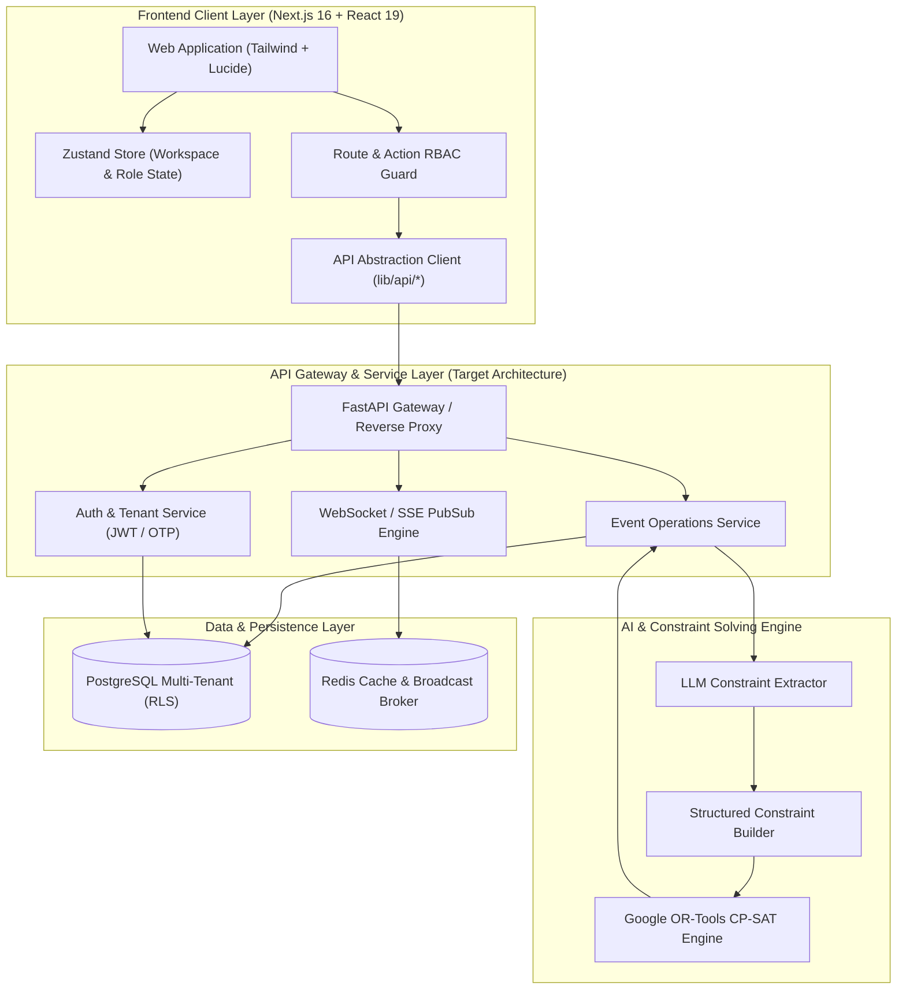
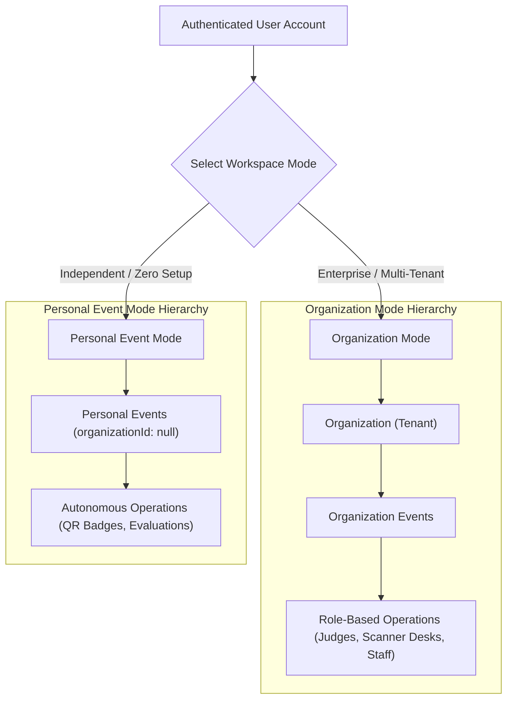
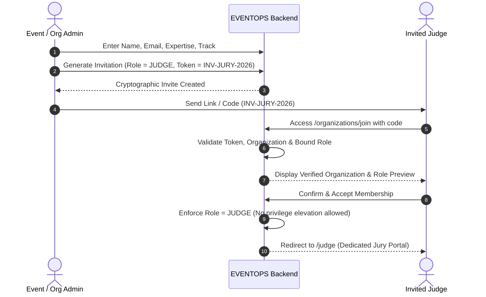
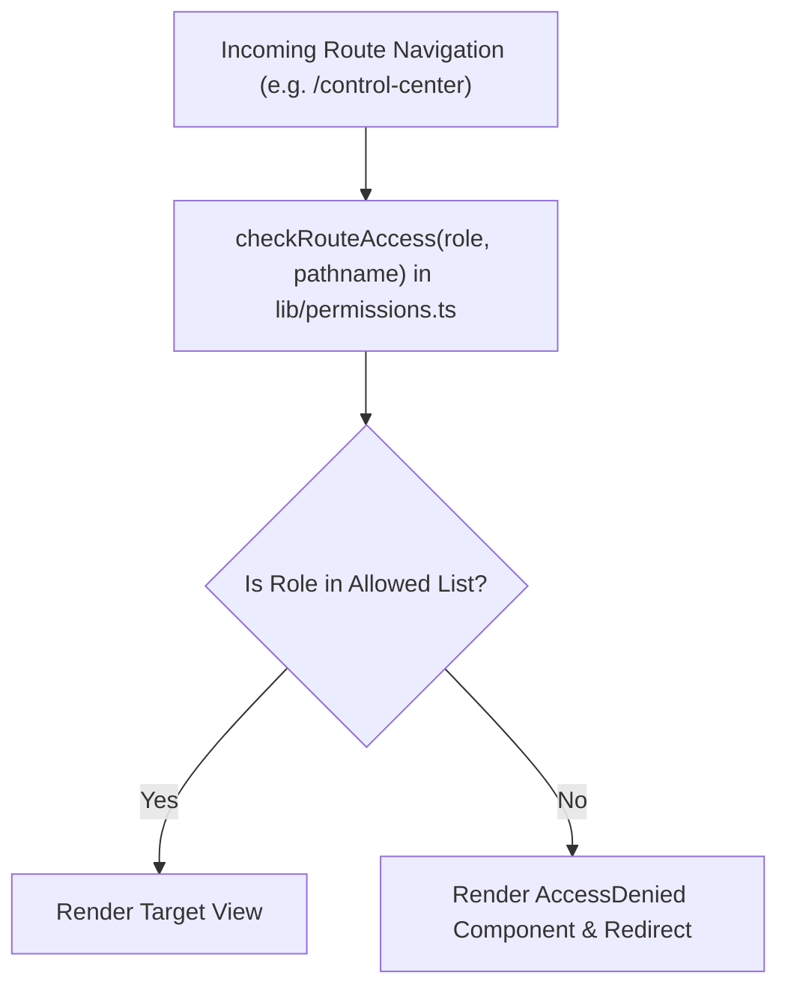
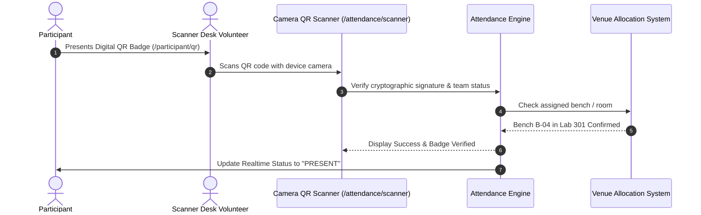
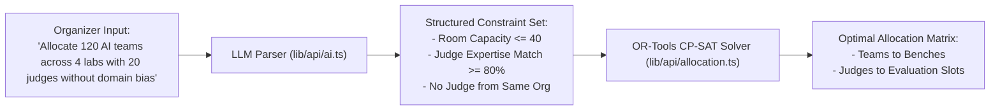
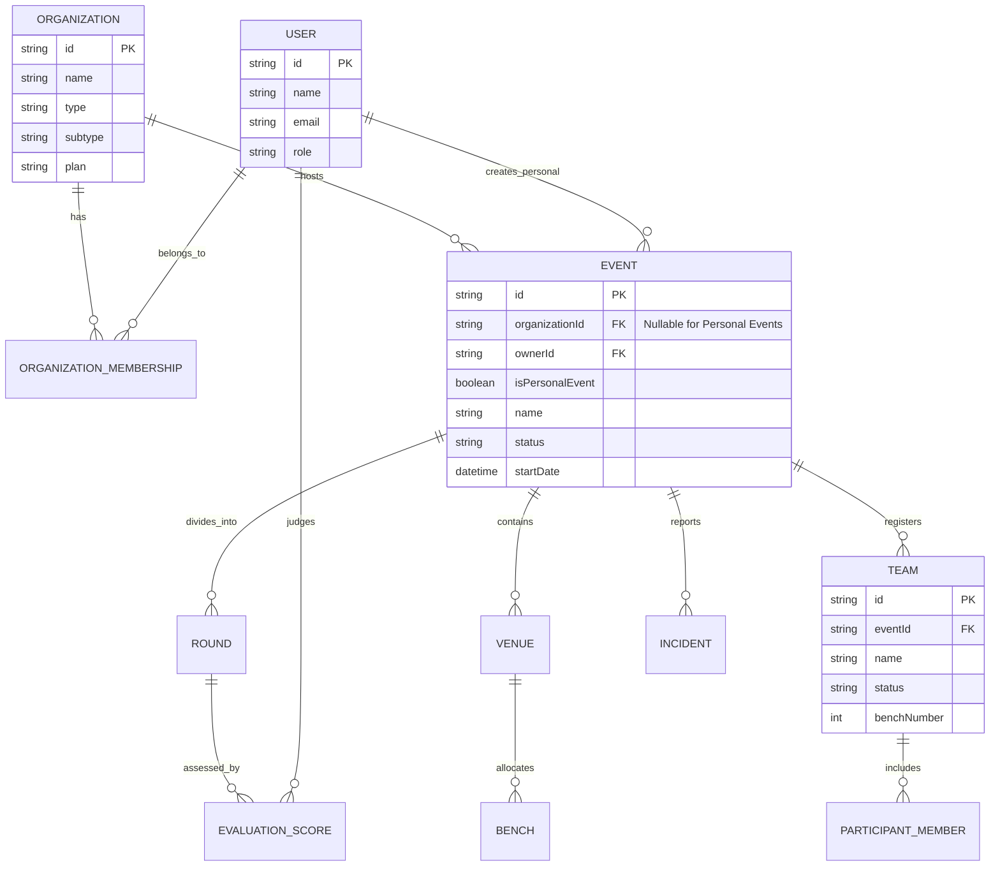

# EVENTOPS — Comprehensive System Architecture Document

**Platform:** AI-Powered Event Operations & Management Platform  
**Tagline:** *Run the event, not the paperwork.*  
**Author/Team:** Panch Pandavs  
**Version:** 2.0.0 (Universal Multi-Tenant SaaS & Personal Events)  
**Status:** Architecture Specification & Frontend Implementation Guide  

---

## 1. Executive Summary & Product Vision

**EVENTOPS** is a universal, multi-tenant Event Operations SaaS platform built to automate and coordinate mission-critical event logistics. While hackathons and collegiate tech symposiums serve as baseline verification scenarios, EVENTOPS is designed to support:

* **Educational Institutions:** Colleges, Universities, Schools, Training Centers
* **Commercial Enterprises:** Startups, Tech Companies, Corporate Retreats, Event Agencies
* **Civic & Non-Profit Organizations:** NGOs, Community Groups, Professional Associations
* **Independent Organizers:** Freelance educators, meetup founders, and workshop conveners

### Core Architectural Axioms
1. **Zero Paperwork:** Every desk check-in, scoring rubric, room assignment, kit handoff, and incident alert is digitized and validated via cryptographic QR codes.
2. **Strict RBAC & Tenant Isolation:** User interfaces, available actions, and data views are enforced via granular Role-Based Access Control at both the routing and component guard levels.
3. **Dual Workspace Paradigm:** Full multi-tenant Organization Mode alongside unconstrained, lightweight Personal Event Mode.
4. **Optimization Ready:** Frontend contracts and state layers are architected for plug-and-play integration with Python FastAPI, PostgreSQL RLS, and Google OR-Tools CP-SAT constraint solvers.

---

## 2. High-Level System Architecture

EVENTOPS operates on a modern 3-tier cloud architecture with real-time reactive clients, an API abstraction gateway, and an asynchronous optimization engine.



---

## 3. Dual Workspace Architecture: Organization vs. Personal Mode

A fundamental capability of EVENTOPS is allowing users to operate within formal corporate/institutional hierarchies or run independent, one-off events without creating dummy organizations.



### Workspace Context Data Model
```typescript
// Organization Workspace Context
interface OrganizationEvent {
  id: string;
  organizationId: string; // Bound to tenant ID
  ownerId: string;
  isPersonalEvent: false;
}

// Personal Event Context
interface PersonalEvent {
  id: string;
  organizationId: null;   // Explicitly null - no fake tenant
  ownerId: string;        // Owned directly by user
  isPersonalEvent: true;
}
```

---

## 4. Role-Based Access Control (RBAC) Architecture

### 4.1. Role Matrix
The platform implements 9 dedicated roles. Access is never inherited through hierarchy; every role receives an explicit permission footprint.

| Role | Target Persona | Accessible Modules | Key Capabilities |
| :--- | :--- | :--- | :--- |
| **SUPER_ADMIN** | Platform Owners | Entire Platform | Multi-tenant governance, system health, tenant provisioning |
| **ORGANIZATION_ADMIN** | Dean, VP, Executive | Organization Dashboard | Multi-event oversight, billing, staff invitations, organization settings |
| **EVENT_ADMIN** | Ops Director | Event Dashboard | Round scheduling, room planning, OR-Tools execution, team approvals |
| **COORDINATOR** | Floor Lead | Floor / Live Ops | Scanner desks, attendance tracking, rapid incident escalation |
| **JUDGE** | Evaluator, Jury | Judge Portal | Assigned team scoring, rubric evaluation, live progress tracking |
| **VOLUNTEER** | Student volunteer | Volunteer Portal | Zone shifts, task checklist, QR badge validation |
| **PARTICIPANT** | Attendee, Student | Participant Portal | Digital QR pass, team roster, schedule, live rankings |
| **TECHNICAL_STAFF** | NetOps, AV Tech | Technical Staff Portal | Power readiness, networking, hardware inspection, AV rooms |
| **RESOURCE_MANAGER** | Catering, Swag lead | Resource Portal | Kit distribution, meal scanning, merchandise inventory |

### 4.2. Role Hierarchy & Assignment Flow
Privileged roles cannot be selected by self-registration. They require authorization via cryptographic invitation codes.



---

## 5. Frontend Architecture & Directory Structure

Built using **Next.js 16 (Turbopack)**, **React 19**, **Tailwind CSS**, and **Zustand**.

```text
eventops/
├── app/                                 # Next.js App Router
│   ├── (auth)/                          # Public auth routes (login, register, forgot-password)
│   ├── workspace/                       # Workspace Selection Hub
│   ├── organizations/                   # Create & Join organization flows
│   ├── personal-events/                 # Personal events hub & standalone event creation
│   ├── dashboard/                       # Executive & Event Operations Dashboard
│   ├── control-center/                  # Live telemetry & incident overview
│   ├── events/                          # Event creation, settings, criteria, timeslots
│   ├── teams/                           # Team management, member rosters, projects
│   ├── attendance/                      # Check-in registry & Camera QR Scanner
│   ├── venues/                          # Venue blueprints, rooms & bench layouts
│   ├── judges/                          # Jury panel management & domain pairing
│   ├── allocation/                      # AI Constraint Builder & OR-Tools Solver view
│   ├── rounds/                          # Round progression & live leaderboards
│   ├── volunteers/                      # Shift schedules & task distribution
│   ├── resources/                       # Inventory, meals & badge logistics
│   ├── incidents/                       # Escalation log & priority dispatch
│   ├── communication/                   # Broadcast notifications & alerts
│   ├── ai-assistant/                    # Natural language operations copilot
│   ├── super-admin/                     # Platform-wide governance portal
│   ├── judge/                           # Evaluator scoring portal
│   ├── participant/                     # Student / attendee portal
│   ├── technical-staff/                 # Facilities & hardware portal
│   └── resource-manager/                # Asset & meal handoff portal
├── components/
│   ├── layout/                          # AppShell, Topbar, Sidebar
│   └── ui/                              # OrganizationSwitcher, RoleSwitcher, QRCard, KPICard, RoomMap
├── lib/
│   ├── api/                             # API service clients (auth, events, allocation, ai, etc.)
│   ├── mock-data/                       # Realistic multi-tenant and personal event fixtures
│   ├── permissions.ts                   # Route-level RBAC access checker
│   └── utils.ts                         # Formatting and style utilities
├── store/
│   └── index.ts                         # Zustand global state (Workspace, Role, User, Active Event)
└── types/
    └── index.ts                         # Universal TypeScript interfaces and schemas
```

### Route-Level RBAC Protection Flow


---

## 6. End-to-End Operational Workflows

### 6.1. Attendee Check-In & Bench Allocation Workflow


### 6.2. AI Constraint & OR-Tools Optimization Pipeline


---

## 7. Data Models & Entity Relationship



---

## 8. Extensibility & Future Backend Integration

The frontend is built with complete API decouplings. Replacing mock implementations with production microservices requires modifying only the `lib/api/*` directory:

1. **FastAPI Endpoints:** `lib/api/events.ts`, `lib/api/auth.ts`, `lib/api/allocation.ts` are 100% async and mirror FastAPI route conventions.
2. **PostgreSQL Relational Schema:** Tables for tenants, memberships, events, and allocations map directly to the interfaces in `types/index.ts`.
3. **WebSockets:** `lib/websocket/index.ts` provides a structured subscribe/publish interface for bidirectional real-time telemetry.
4. **CP-SAT Integration:** The constraint payload schema sent by `lib/api/allocation.ts` directly satisfies Google OR-Tools Python solver bindings.
